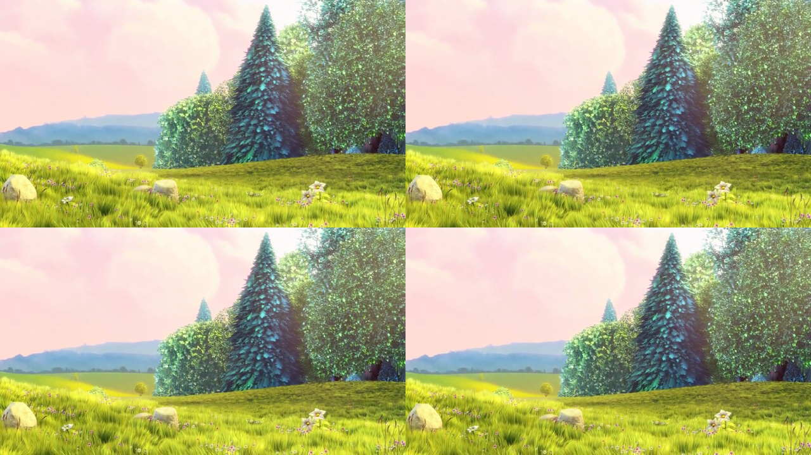
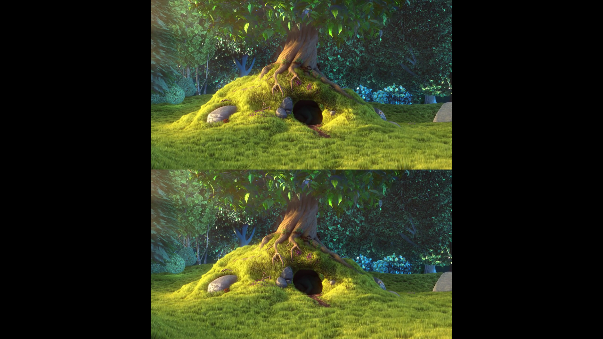

# ApeSports

Google TV sports multiview app. The initial Android preview is currently named **Gridiron TV** on the TV launcher.



## Current preview · 0.2

A native, remote-controlled Android / Google TV player with an NFL-focused feed list and up to four simultaneous players. Built for a personal Hisense Google TV installation.

**This preview does not include NFL broadcasts or a working SportzX integration.** Add accessible HLS (`.m3u8`), DASH (`.mpd`), or direct video links, or import an M3U channel catalog. Test mode contains clearly labeled Big Buck Bunny videos.

## Install on the TV

Download the `ApeSports-debug-apk` artifact from a successful **Actions → Android build** run and extract `app-debug.apk`. The local preview is distributed as `ApeSports-0.2-debug.apk`; either filename can be installed. CI uses a temporary debug signing key, so builds from different runs may require uninstalling the previous app first, which clears saved feeds.

1. Transfer `ApeSports-0.2-debug.apk` to the TV using a USB drive or your preferred file-transfer app.
2. Open the APK in a TV file manager. If prompted, allow that file manager to install unknown apps, then install.
3. Open **Gridiron TV** from the TV's apps list.
4. Choose **Sources → Load 4 test videos** to check four-player decoding and network performance.
5. To use real feeds, choose **Sources → Add a game stream URL**, or import an M3U catalog. Select an empty slot and press OK to choose a saved feed.

You can also install through Android Debug Bridge after enabling and connecting the TV's debugging interface:

```powershell
adb devices
adb -s YOUR_TV_SERIAL install -r GridironTV-0.1-debug.apk
```

`YOUR_TV_SERIAL` must be the TV entry reported by `adb devices`. The app is a debug-signed preview for sideloading, not a Play Store release. Future updates must use the same signing key to preserve installed data; otherwise uninstalling clears saved feeds.

## Full-screen layouts

The entire TV display is the playback canvas, with no permanent header, footer, tile padding, or gutters.

- **1 game:** one viewport covering the entire screen.
- **2 games:** two equal-height viewports, one above the other.
- **4 games:** four equal viewports in a 2×2 grid.

Every video uses aspect-ratio-preserving fit mode. Footage is never cropped or stretched to fill a viewport; unused space is pure black. For example, two 16:9 feeds on a 16:9 TV each occupy the centered half-width area of their row, with black to the left and right.

Controls and game labels float over playback and disappear after five seconds of inactivity. Press Back or Menu to access Sources and layout buttons. Controls never change video size. Error messages remain available when a feed fails.



## Remote controls

| Control | Action |
|---|---|
| D-pad | Move focus between buttons and game tiles |
| OK on an empty tile | Choose a feed |
| OK on a playing tile | Make that game's audio audible |
| Hold OK on a playing tile | Full screen, replace, retry, or remove |
| Back after expanding one game | Return to multiview |
| Back in the regular layout / Menu | Show controls; Back again hides them |
| Done / Exit in controls | Hide controls / leave the app |
| Remote play/pause | Pause or resume all active players |
| 1 / 2 / 4 games in controls | Change layout and number of active players |

Only one player's volume is enabled at a time. Switching to one or two views releases the hidden players; their assignments are remembered when you return to four views. Leaving the app releases every player. Returning reconnects the selected feeds.

## Feed requirements and limits

- Feed URLs must be directly playable HTTP(S) URLs. Web pages are not media URLs.
- HLS and DASH support adaptive quality. Multiview requests up to 720p and 2.5 Mbps per stream; actual decoding depends on available renditions and the device. A fixed-resolution file cannot be reduced simply by requesting lower quality.
- Playlist import uses NFL/team-name text matching, not a verified event schedule. Team names shared with other sports can match. Remove irrelevant saved entries through **Manage saved feeds**.
- M3U imports are additive, deduplicate by URL, and stop at 200 saved entries. They are limited to 2 MB. Single-stream HLS playlists must be added through **Add a game stream URL**.
- Custom request headers, M3U header directives, authenticated provider login, DRM licenses, and server-side token refresh are not implemented. Expired or protected URLs may fail.
- There is no score service, verified fixture schedule, synchronized playback, or automatic recovery from decoder exhaustion. Use **Retry playback**, or reduce the layout to two or one views if the TV struggles.
- Feed URLs are kept in app-private preferences, excluded from Android cloud backup; this preview does not encrypt them separately.
- HTTP is permitted to support local/LAN feeds. Prefer HTTPS when available.
- Long feed titles and diagnostics may truncate in small tiles. Hold OK to see the full title and retry controls.

## Build

Install JDK 17 and Android SDK platform 35. Open this directory in Android Studio or set `sdk.dir` in a local `local.properties` file, then run:

```powershell
.\gradlew.bat assembleDebug testDebugUnitTest lintDebug
```

The APK is generated at `app/build/outputs/apk/debug/app-debug.apk`. Android Gradle Plugin 8.7.3, Gradle 8.9, and Media3 1.4.1 are pinned for this preview. Gradle downloads dependencies on first build. Do not bundle the locally generated debug keystore in shared source archives.

## Architecture

`MainActivity` owns up to four Media3 ExoPlayer instances, renders a native TV view hierarchy, manages audio and lifecycle cleanup, and persists assignments. `FeedParser` handles URL validation and M3U channel filtering. Network catalog loading runs on a worker thread, with connect/read timeouts and a bounded response size.

The implementation is original. No decompiled SportzX application code, artwork, private credentials, or packed libraries are included.

Official playback references: [Media3 ExoPlayer](https://developer.android.com/media/media3/exoplayer/hello-world) and [Android TV playback](https://developer.android.com/training/tv/playback).

See [preview validation](docs/validation.md) for the tested behavior and remaining device checks.
